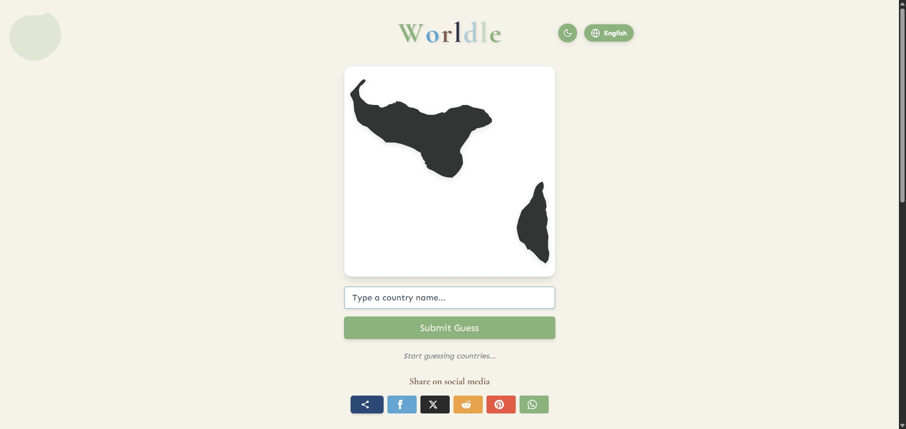

# World Geography Guessing Game (Game-Worldle)



A geography guessing game inspired by Wordle. Guess a different country or territory each day by identifying world locations through their outlines.

## 🌟 Features

- 🗺️ Guess locations based on country/territory outlines
- 🧭 Get distance and direction hints to help you narrow down the correct answer
- 🌐 Multi-language interface support
- 🌙 Light and dark theme with beautiful Ghibli-style UI
- 📱 Responsive design for various device screens
- 🔄 Maximum of 8 guesses allowed per game

## 🚀 Tech Stack

- [Next.js](https://nextjs.org/) - React framework
- [React](https://reactjs.org/) - UI library
- [Redux](https://redux.js.org/) - State management
- [Tailwind CSS](https://tailwindcss.com/) - Styling toolkit
- [i18next](https://www.i18next.com/) - Internationalization support

## 📋 Installation

1. Clone the repository:
```bash
git clone https://github.com/yourusername/game-worldle.git
cd game-worldle
```

2. Install dependencies:
```bash
npm install
# or using pnpm
pnpm install
```

3. Run the development server:
```bash
npm run dev
# or using pnpm
pnpm dev
```

4. Open [http://localhost:3000](http://localhost:3000) in your browser

## 🏗️ Building for Production

```bash
npm run build
npm run start
# or using pnpm
pnpm build
pnpm start
```

## 🎮 Game Rules

1. A random country/territory outline is generated each day
2. You have 8 chances to guess the correct country
3. After each guess, the game will tell you:
   - How far away the target country is (in kilometers)
   - The direction of the target country relative to your guess
4. Use these clues to gradually narrow down your search and find the correct answer

## 🌍 Data Sources

The game uses vector outlines (SVG) of countries around the world, organized by ISO country codes.

## 🤝 Contributing

Issues and Pull Requests are welcome to improve the game!

## 📄 License

This project is open source under the [MIT License](License).
